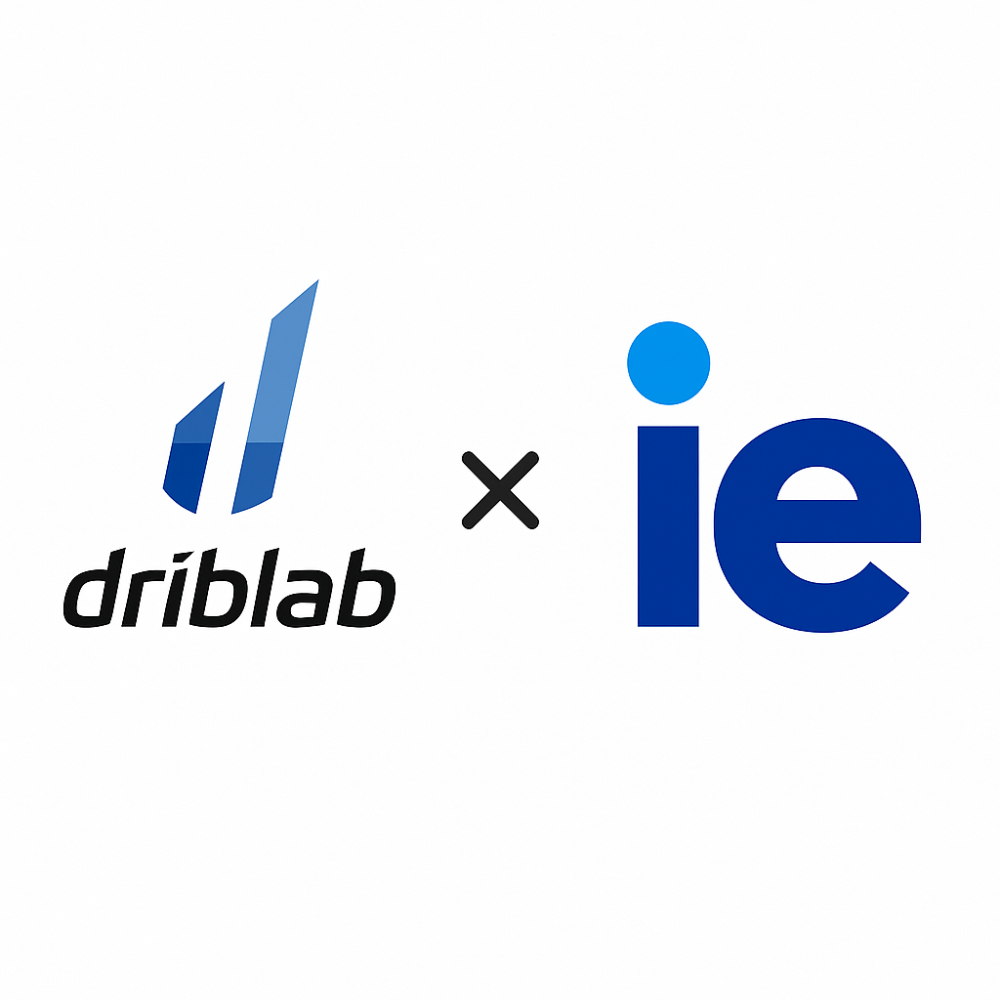

# Enhanced xG Prediction Pipeline — Driblab Capstone

This repository contains a modular and testable pipeline for predicting enhanced expected goals (xG) using football event and tracking data.

Unlike traditional xG models that only consider shot location or body part, this project incorporates rich context—such as player positions and defensive pressure—by aligning event (shot) and tracking data.

---

## Objectives

- Data alignment: Align event (shot) and tracking data using timestamps and mappings
- Modular pipeline: Build an end-to-end pipeline from raw data to predictions
- Professional structure: Deliver a structured, reproducible repository
- MLOps best practices: Implement model management and deployment practices

---

## Technology Stack

- Python 3.8+
- pandas — Data manipulation and analysis
- numpy — Numerical operations
- joblib — Model serialization
- argparse — Command-line interface
- json — Data file parsing
- PyYAML — Configuration management
- scikit-learn — Machine learning framework

---

## MLOps Features

- Configuration management: Centralized `config.yaml` for all pipeline parameters
- CI/CD pipeline: Automated testing on every push and pull request (configured for macOS, Windows, and Linux; only macOS is fully verified)
- Model registry: Version control and metadata tracking for models

---

## Platform Compatibility

To run this project seamlessly, it should be run on **macOS**. While it is still not tested on **Windows** or **Linux**, the code and dependencies are all cross-platform, so it should run on those systems as well (we'd recommend Ubuntu 24.04 LTS for Linux users). The instructions below provide OS specific commands where necessary. 

---

## How to Run the Project In a Clean Environment

### 1. Clone the Repository

```bash
git clone https://github.com/yotaenom/driblabxg_capstone.git
cd driblabxg_capstone
```

### 2. Create and Activate a Virtual Environment

#### macOS/Linux
```bash
python3 -m venv driblabxg-venv
source driblabxg-venv/bin/activate
```

#### Windows (Command Prompt)
```cmd
python -m venv driblabxg-venv
driblabxg-venv\Scripts\activate
```

#### Windows (PowerShell)
```powershell
python -m venv driblabxg-venv
.\driblabxg-venv\Scripts\Activate.ps1
```

### 3. Install Dependencies

```bash
pip install --upgrade pip
pip install -r requirements.txt
```

### 4. Configure the Pipeline (Optional)
Customize the Pipeline: The default configuration works. Any customization is optional.

Edit `config.yaml` to customize:
- Data paths
- Model settings
- Output preferences
- Validation requirements

### 5. Prepare Your Data
- Place your shot, tracking, and mapping JSON files in the appropriate folders under `data/shot_pack/` as shown below.

Data folder structure:
```
data/
└── shot_pack/
    ├── shots/      # Shot data (JSON format)
    ├── jsonls/     # Tracking data (JSONL format)
    └── mappings/   # Mapping files (JSON format)
```

---

## Execute Predictions

To run the pipeline with the default configuration:
```bash
python predict_xg.py
```

To run the pipeline with custom paths:
```bash
python predict_xg.py \
  --shots_path data/shot_pack/shots/your_shots.json \
  --tracking_path data/shot_pack/jsonls/your_tracking.jsonl \
  --mapping_path data/shot_pack/mappings/your_mapping.json \
  --model_path models/registry/your_model.pkl \
  --output_path output/your_predictions.csv
```
---

## Folder Structure
```
driblabxg_capstone/
├── Model_Management.md      # Model management documentation
├── data/
│   └── shot_pack/
│       ├── shots/      # Shot data (JSON format)
│       ├── jsonls/     # Tracking data (JSON format)
│       └── mappings/   # Mapping files (JSON format)
├── models/             # Trained model files (.pkl, .joblib, etc.)
│   └── registry/       # Model registry metadata
├── output/             # Prediction results (CSV)
├── src/                # Core pipeline modules
│   ├── data_loader.py
│   ├── data_preprocessing.py
│   ├── data_validation.py
│   ├── inference.py
│   ├── logger.py       # Centralized logging
│   └── model_registry.py # Model versioning
├── historical/         # Development files (notebooks, old data, etc.)
├── .github/workflows/  # CI/CD pipeline
│   └── test.yml
├── config.yaml         # Pipeline configuration
├── predict_xg.py       # Main script to run the pipeline
├── register_model.py   # Model registration script
├── requirements.txt    # List of required Python libraries
└── README.md           # This guide
```

---

## Authors
Martin Gutierrez  
Diego Lopez  
Alexander Karam  
Yotaro Enomoto  
Africa Bajils  
Alejandro Osto

---

## Troubleshooting

| Problem                        | Solution                                              |
|--------------------------------|-------------------------------------------------------|
| `model.pkl` not found          | Ensure your trained model is in the `models/` folder  |
| `shots/*.json` not found       | Place shot files in `data/shot_pack/shots/`           |
| `jsonls/*.json` not found      | Place tracking files in `data/shot_pack/jsonls/`      |
| `predict_xg.py` fails          | Check that all required arguments are provided         |
| Output file not generated      | Check for errors in the console and data formatting    |
| Configuration errors           | Verify `config.yaml` file format and paths            |

If you are missing files, check the `historical/` directory for old notebooks, CSVs, and documentation from previous development stages.

---

For advanced model management (registering new models, versioning, and metadata), see [Model_Management.md](./Model_Management.md).

---

